# Laboratorio: Social Analyzer en Kali Linux 2025.1c

Este repositorio contiene mi laboratorio completo, actualizado y exclusivo sobre el uso de **Social Analyzer** tanto en su modo CLI como en su versión WebApp. El análisis se ha realizado en Kali Linux 2025.1c, y se ha documentado todo el proceso, incluyendo ajustes necesarios debido a cambios recientes en la herramienta.

---

## 🔍 Contenido del laboratorio

### Fase 1: Entorno y configuración

- Cloné el repositorio oficial desde GitHub.
- Creé y activé un entorno virtual en Python 3.
- Instalé las dependencias necesarias, incluyendo Flask (clave para la WebApp).

### Fase 2: Uso en modo CLI (terminal)

⚠️ El archivo `social-analyzer.py` ha sido eliminado. Ahora todo se gestiona desde `app.py`.

#### Ejecución de análisis general:

python3 app.py --mode fast --username ejemplo --top 50 --output pretty --method find --filter good --profiles detected

Análisis por red específica (ejemplo: GitHub):

python3 app.py --mode fast --username ejemplo --websites github --output pretty --options link,rate,title --method find --filter good,maybe --profiles detected

Los resultados devuelven estados como filtered, unavailable o el nombre de la red social (GitHub, Reddit…), junto con un “rate” de coincidencia.

### Fase 3: Uso de la WebApp
Social Analyzer actualmente prioriza la versión WebApp mediante Flask.

El intento de lanzar manualmente flask run resultó en errores porque app.py no expone directamente la app Flask.

Tras revisar docker-compose.yml, se confirmó que el proyecto está preparado para ejecutarse con Docker.

Docker solucionó todos los conflictos y lanzó automáticamente: _La WebApp_

El navegador Firefox (automatizado con Selenium)

http://localhost:9005/app.html

Los resultados mostrados fueron idénticos a los del modo CLI.

#### Retos y observaciones

Muchos tutoriales en línea están obsoletos debido a la eliminación de social-analyzer.py.

Fue necesario explorar el código fuente (app.py) para entender la nueva estructura.

La herramienta está orientada principalmente al modo WebApp.

Docker fue clave para superar errores de entorno.

#### Estado del repositorio
Laboratorio completado
Incluye mejoras y observaciones exclusivas
Compatible con la versión de Social Analyzer a julio de 2025

⚠️ Nota
Este laboratorio fue realizado con fines exclusivamente educativos y defensivos.

---

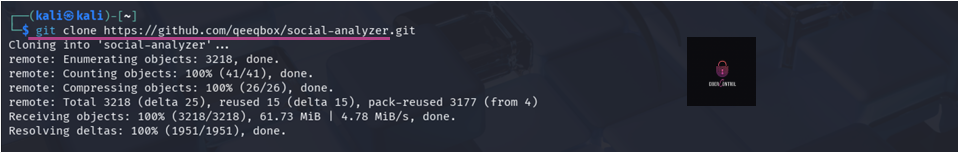

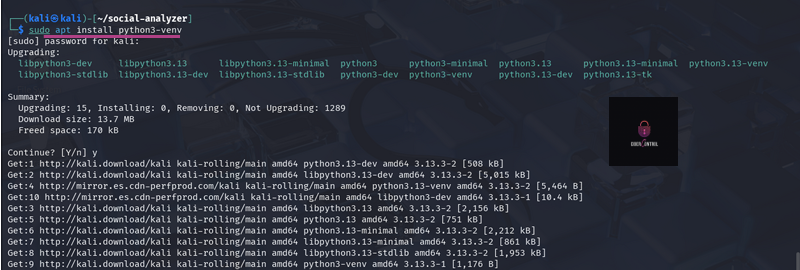
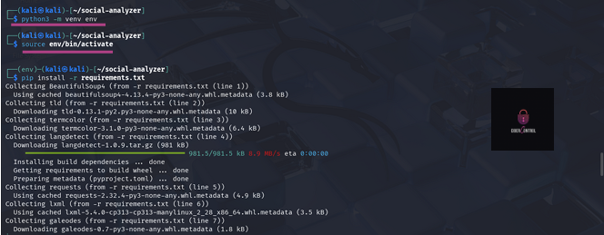
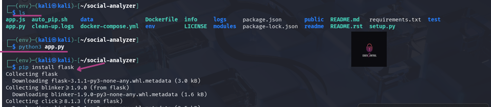
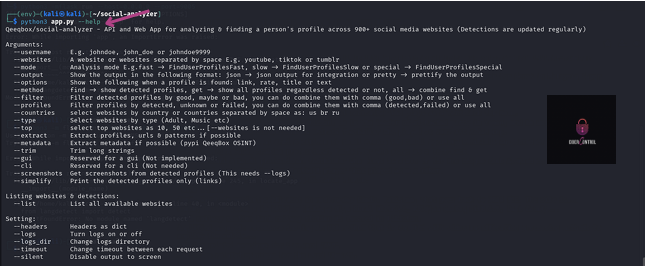

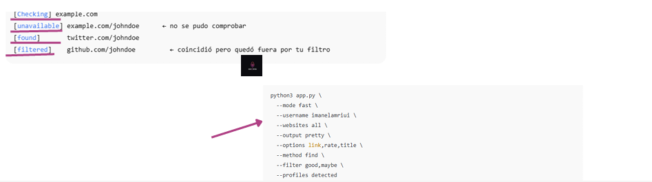
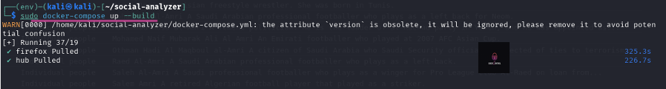
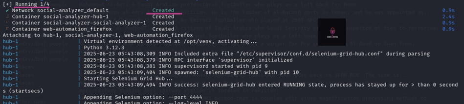

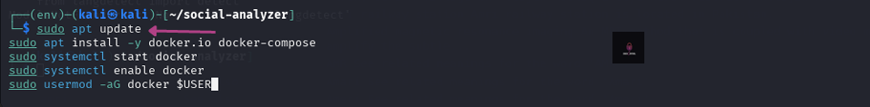
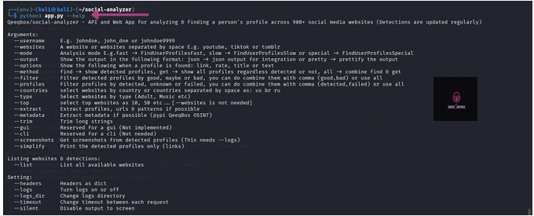
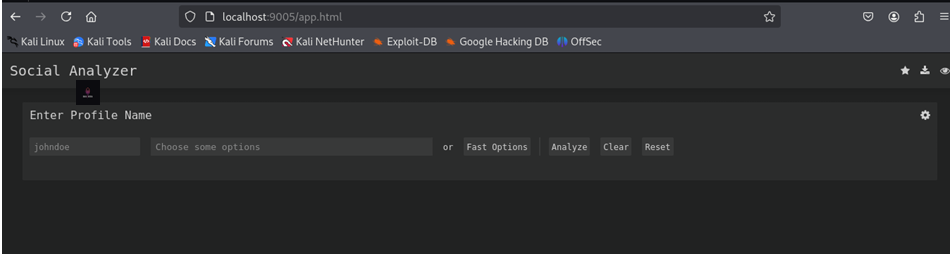
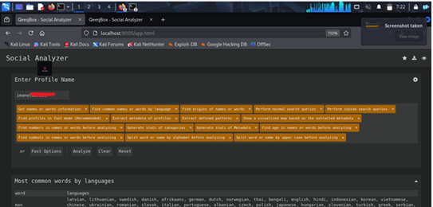

**Este laboratorio se ha realizado únicamente con fines educativos y defensivos.**
