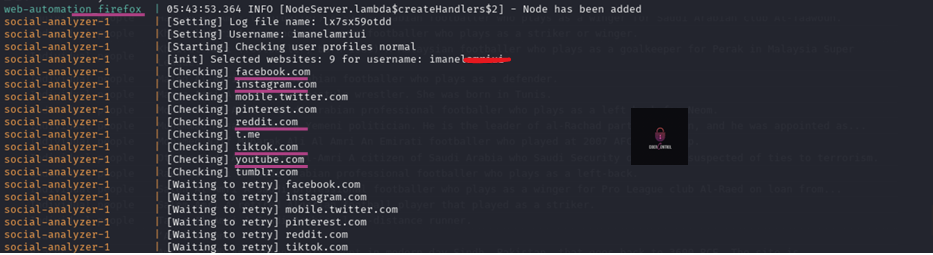

# SocialAnalyzer-OSINT-Lab-Exclusivo-2025
## Laboratorio completo con Social Analyzer (CLI + WebApp) en Kali Linux 2025.1c

Después de múltiples pruebas, ajustes y resolución de errores, he completado este laboratorio con la herramienta Social Analyzer, integrando tanto su modo CLI como la versión WebApp.

Este proyecto documenta mi experiencia real, incluyendo configuración de entorno, ejecución por línea de comandos, solución de conflictos en la interfaz web, y puesta en marcha mediante Docker.

Incluye observaciones propias sobre los cambios recientes en el proyecto, como la eliminación de archivos antiguos, el nuevo enfoque centrado en la WebApp, y la importancia de entender el código fuente para adaptarse.

Este laboratorio es exclusivo, actualizado y orientado a un uso educativo y defensivo de herramientas OSINT en entornos Linux.  
Todas las fases están ilustradas paso a paso en imágenes.

> Herramienta: Social Analyzer  
> Sistema: Kali Linux 2025.1c  
> Modalidades: CLI + WebApp (Flask + Docker)  
> Estado: Completo y funcional  
> Enfoque: Educación en ciberseguridad, análisis OSINT

---

**Este laboratorio se ha realizado únicamente con fines educativos y defensivos.**
